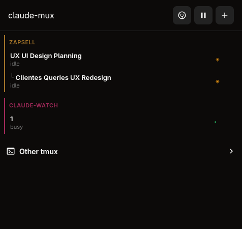
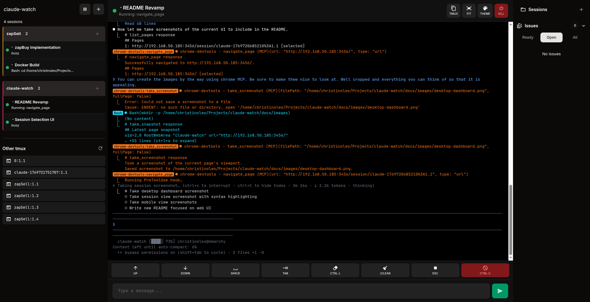
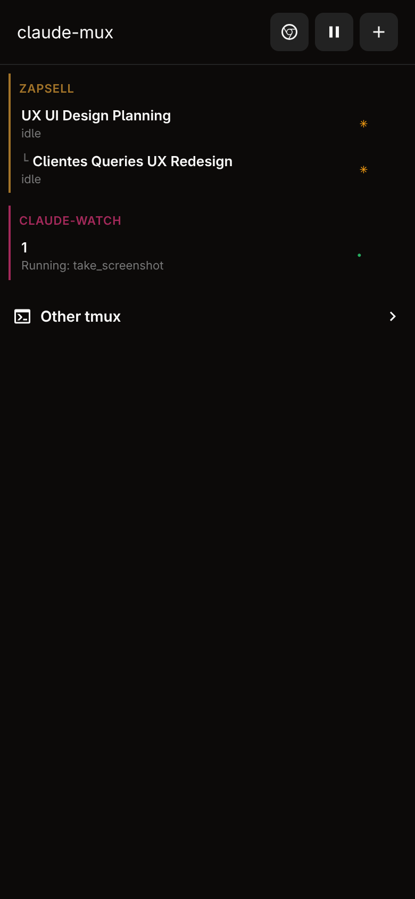
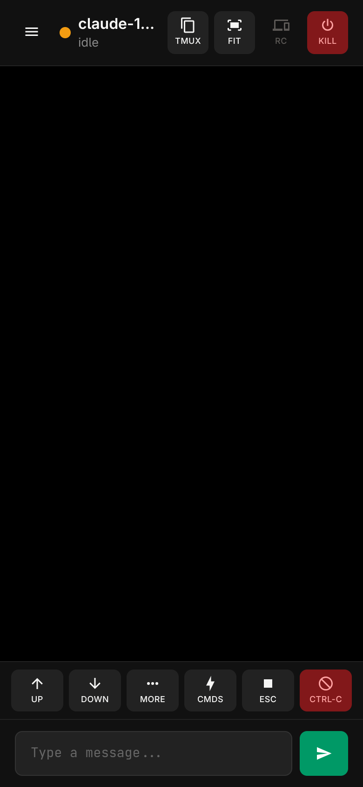

<p align="center">
  <h1 align="center">claude-mux</h1>
  <p align="center">
    <strong>Real-time web dashboard for monitoring and controlling multiple Claude Code sessions</strong>
  </p>
</p>

<p align="center">
  <a href="https://www.npmjs.com/package/claude-mux"></a>
  <a href="https://www.npmjs.com/package/claude-mux"></a>
  <a href="https://github.com/christinoleo/claude-mux/blob/main/LICENSE"></a>
  
  
</p>

<p align="center">
  <a href="#features">Features</a> &bull;
  <a href="#installation">Installation</a> &bull;
  <a href="#quick-start">Quick Start</a> &bull;
  <a href="#cli-commands">CLI</a> &bull;
  <a href="#how-it-works">Architecture</a>
</p>

---

<p align="center">
  
  <br><em>Dashboard &mdash; sessions grouped by project with live state indicators</em>
</p>

<p align="center">
  
  <br><em>Session view &mdash; real-time ANSI terminal output with action toolbar</em>
</p>

<details>
<summary><strong>Mobile</strong></summary>
<br>
<p align="center">
  
  &nbsp;&nbsp;&nbsp;
  
</p>
<p align="center"><em>Fully responsive &mdash; control sessions from your phone</em></p>
</details>

---

## Features

- **Live session monitoring** &mdash; WebSocket-powered, no polling. See state (busy/idle/waiting/permission) at a glance
- **Project grouping** &mdash; sessions organized by working directory with color-coded borders
- **ANSI terminal rendering** &mdash; real tmux colors via [ansi_up](https://github.com/drudru/ansi_up), toggleable
- **Session control** &mdash; send text, keys (Up/Down/Tab/Esc/Ctrl-C), Yes/No/Always quick buttons
- **Orchestrator pairing** &mdash; main + orchestrator sessions grouped together with role labels
- **Remote Control** &mdash; auto-detects Claude's `/rc` and opens it in a new window
- **Mobile-first** &mdash; touch toolbar, hamburger sidebar, swipe gestures
- **Beads integration** &mdash; browse issues/epics from the sidebar, inject IDs into input
- **Screenshots panel** &mdash; view and dismiss captured screenshots
- **Dead pane detection** &mdash; visual indication when a tmux pane closes
- **Other tmux panes** &mdash; browse and view non-Claude panes too
- **Auth support** &mdash; optional password protection for LAN access
- **CLI scripting** &mdash; `send`, `wait`, `status`, `capture` commands for automation

---

## Installation

```bash
bun install -g claude-mux
# or: npm install -g claude-mux
```

<details>
<summary><strong>From source</strong></summary>

```bash
git clone https://github.com/christinoleo/claude-mux.git
cd claude-mux
bun install && bun run build
bun link  # makes 'claude-mux' available globally
```
</details>

---

## Quick Start

```bash
# 1. Install hooks into Claude Code
claude-mux setup

# 2. Start the web server
claude-mux serve --port 3456 --host 0.0.0.0

# 3. Open http://localhost:3456 (or your LAN IP)
# 4. Start any Claude Code session — it appears automatically
```

---

## CLI Commands

| Command | Description |
|---------|-------------|
| `claude-mux serve` | Start web server (`--port`, `--host`, `--auth <password>`) |
| `claude-mux setup` | Install Claude Code hooks |
| `claude-mux uninstall` | Remove hooks and configuration |
| `claude-mux send <target> [text]` | Send text or `--keys` to a session |
| `claude-mux status <target>` | Get session state as JSON |
| `claude-mux wait <target>` | Block until session reaches `--state` (default: idle,waiting,permission) |
| `claude-mux new-session --cwd <path>` | Spawn a new detached Claude Code session |
| `claude-mux capture <target>` | Capture tmux pane output (`--lines N`) |
| `claude-mux` | TUI dashboard (legacy, requires tmux) |

---

## How It Works

```
Claude Code events  ──>  Hook script  ──>  JSON files (~/.claude-mux/sessions/)
                                                    |
                                           File watcher (500ms)
                                                    |
                                           WebSocket broadcast
                                                    |
                                           Browser  <──>  SvelteKit server
```

**Hooks** run inside Claude Code's process and write session state to JSON on every event (start, prompt, tool use, stop, notification). The **SvelteKit server** watches those files and pushes updates to connected browsers via WebSocket. Terminal output is captured directly from tmux panes.

---

## Troubleshooting

**Sessions not appearing** &mdash; Run `claude-mux setup`, then restart Claude Code sessions (hooks load at startup).

**Can't connect from another device** &mdash; Use `--host 0.0.0.0` and check your firewall.

**Status not updating** &mdash; Verify hooks: `grep claude-mux ~/.claude/settings.json`

---

## Requirements

- [Bun](https://bun.sh) >= 1.0
- tmux
- Claude Code with hooks support

---

## License

MIT

## Contributing

PRs welcome. Fork, branch, test (`bun test`), and open a PR.
