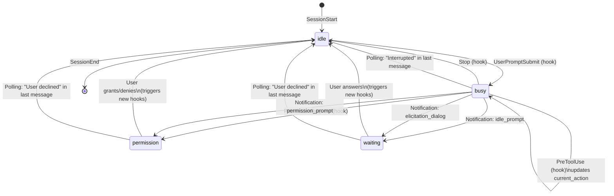

# Session State Transitions

## States

| State | Color | Description |
|-------|-------|-------------|
| `idle` | Yellow | Ready for new task |
| `busy` | Green | Working (thinking, tool use) |
| `waiting` | Red | Asking user a question |
| `permission` | Red | Needs permission to proceed |

## Transition Diagram



## Hooks

| Hook | Transition | Description |
|------|------------|-------------|
| `SessionStart` | → `idle` | New session registered |
| `UserPromptSubmit` | → `busy` | User submitted a prompt |
| `PreToolUse` | stays `busy` | Updates `current_action` with tool name |
| `PostToolUse` | stays `busy` | Clears tool-specific status |
| `Stop` | → `idle` | Claude finished responding |
| `PermissionRequest` | → `permission` | Needs permission for action |
| `Notification: permission_prompt` | → `permission` | Permission dialog shown |
| `Notification: idle_prompt` | → `waiting` | Question for user |
| `Notification: elicitation_dialog` | → `waiting` | Menu/choice for user |
| `SessionEnd` | (removed) | Session ended |

## Polling Detection

Polling runs every 2 seconds and checks tmux pane content for explicit interruption/cancellation signals.

### Detection Logic

| Signal | Action |
|--------|--------|
| Last Claude message contains "Interrupted" | Set state to `idle` |
| Last Claude message contains "User declined to answer" | Set state to `idle` |
| Otherwise | Trust hooks, don't change state |

### Why Explicit Signals?

Claude Code doesn't fire hooks when the user presses Escape to interrupt or cancel. Polling detects these cases by looking for explicit messages in the pane:

**Interrupted** (user pressed Esc while Claude was working):
```
● Bash(ls)
  ⎿  Interrupted · What should Claude do instead?

─────────────────────────────────────────────────
❯
```

**Declined** (user pressed Esc on a question/menu):
```
● User declined to answer questions

─────────────────────────────────────────────────
❯
```

### Scoped Detection

To avoid false positives from older history in the scrollback, the detection algorithm:

1. **Skip if active UI**: If "Esc to cancel", "Esc to interrupt", or "ctrl+c to interrupt" appears in the bottom 5 lines, there's an active menu or Claude is working - don't detect old interruptions
2. **Find prompt separators**: Locate the two `─────` separator lines around the prompt area
3. **Find interaction start**: Scan backwards from the TOP separator to find a line starting with `●` (Claude output) or `❯` (user prompt)
4. **Check the slice**: Look for "Interrupted" or "User declined" only in the slice between the interaction start and the TOP separator

```
❯ run ls                    ← interaction start
  ⎿  Interrupted...         ← signal in this slice

─────────────────────────   ← TOP separator
❯                           ← prompt area
─────────────────────────   ← BOTTOM separator
  status line
```

### Why This Works

- **Active UI protection**: Menus and working states show "Esc to cancel/interrupt" at the bottom, so we skip detection entirely
- **Scoped to last interaction**: We only check between the last `●`/`❯` and the separator, not the entire scrollback
- **Hooks handle normal cases**: State transitions for normal completion, questions, and permissions are handled by hooks
- **Polling only catches Escape**: The only case polling handles is when the user presses Escape (no hook fires)
